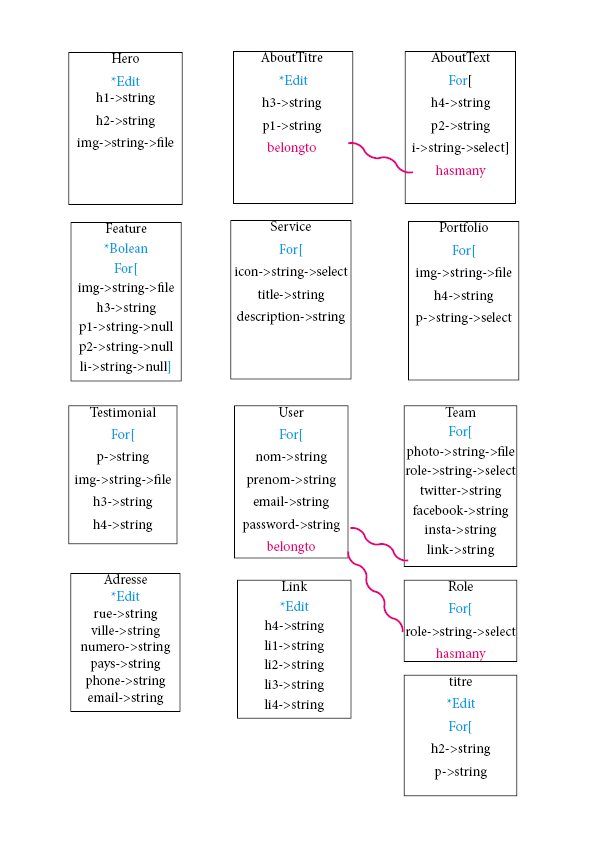

Dans cette exo, nous devons intégrer une dataBase dans un backOffice permettant de customiser le front d'un template.
Il faudra intégrer un dark mode en javascript.

Langage utilisé:
                -Html
                -Css
                -Sass
                -Javascript
                -Laravel
                -Bootstrap

*Par défaut les noms dans les database corresponde au balise, sauf si cette dernière possède un nom dans ça classse

